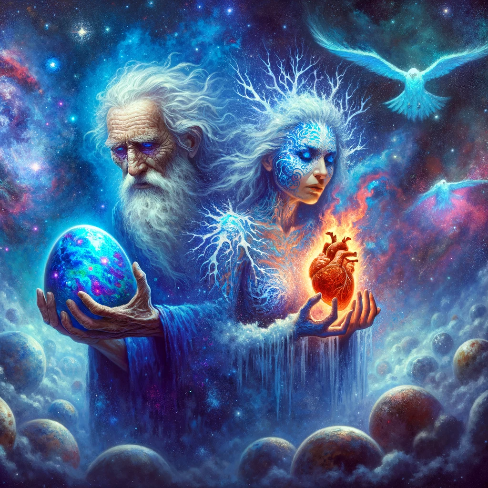
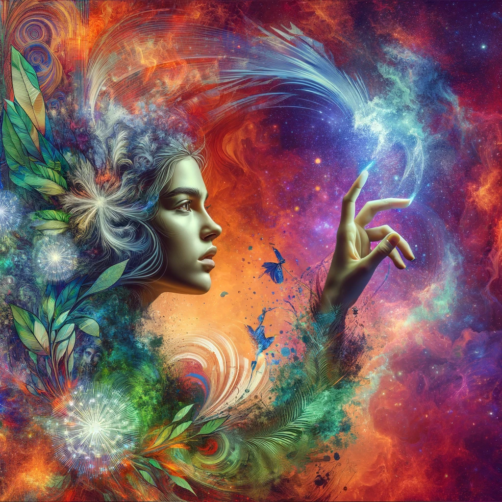
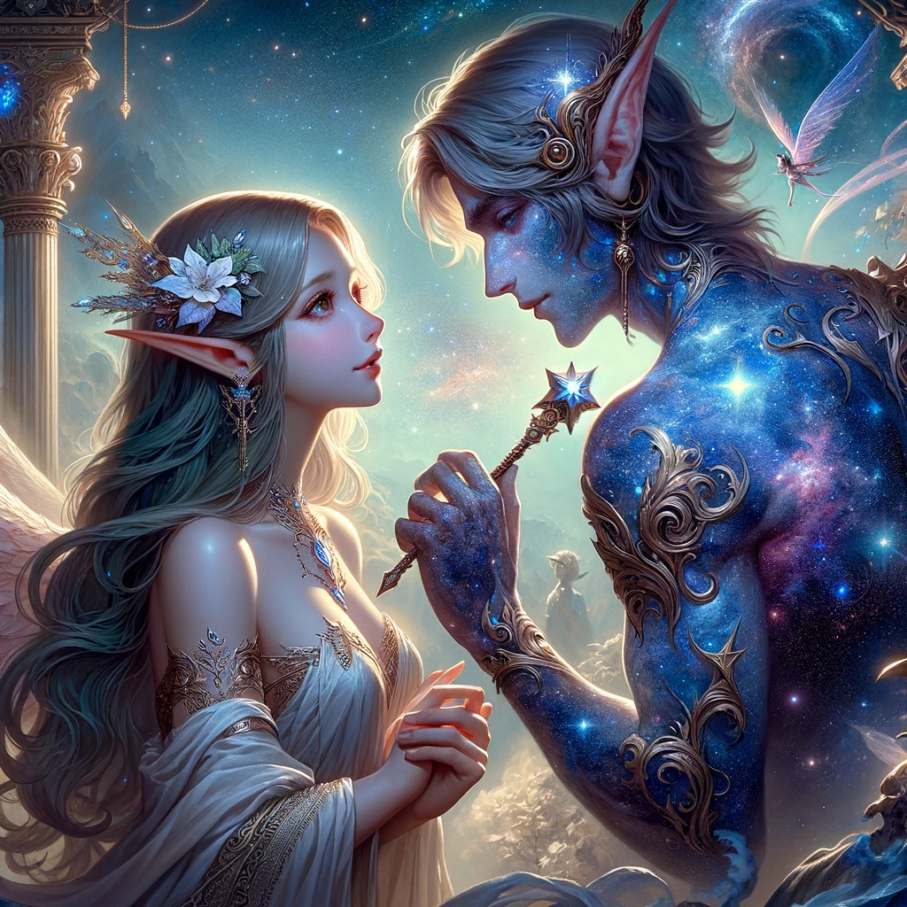

From the virgin Cosm the twin gods were born. Dethiom - a decrepit old thing, who would come to govern death, and Graiftic - his counterpart, weathered and brazen her name was yet to be synonymous with the season of winter.
They crawled forth into their newfound godhood, he only carrying a blue egg of vivid patterns and her embracing a subtlety beating, smoldering heart.
With Dethiom's presence, the first mortals emerged. Unbound and without purpose, they roamed the icy dessert of Graiftic, aimlessly.

But the Cosm wasn't barren. Chaos resided, and it had a part yet to be played. For through the vile covenant between mortals and Chaos, Virstat was born. A young woman, who had managed to seek out Chaos, and shed her mortality, achieved divinity. Virstat brought nature to the Plane of Üdonzviel. Jungles, plains, forests, fields all came to be, in her name. The mortals thrived alongside nature and an era of tranquility ushered in.

Then a most peculiar thing happened. The Cosm fell in love with itself.
Viviren, a descendant of the once depraved mortals, was a paragon of beauty. Enchanted by this being, the Cosm manifested into Cerulion: shard of the Cosmos and God of the forge. Cerulion wielded the Dawnhammer and with it forged the first star, in an attempt to beguile the fair Viviren. Then as the star shed light on Üdonzviel, the mortals came to know warmth, and Viviren, through the Cosm's affection, gained her title as goddess of love.

The union of Cerulion and Viviren brought forth a new deity: Luna. Their child, Goddess of the Moon, was a product of passion, yet tragically also one entirely devoid of compassion. Alas, no love may burn, without the kindling to sustain it and without compassion the divine pairing ultimately split leaving the infant Luna mostly in the care of Cerulion. The split brought strife upon the celestial court and what started as ripples within the Divine Pantheon, cascaded into deadly conflict amongs the mortals. Üdonzviel saw her first wars. They were numerous, and bloody.

One Warlord rose above the rest. A man whose mortal name has long since been forgotten. This warlord was a being a of pure greed and chaos. But these were the traits necessary, for conquering the scarred Üdonzviel. His conquest spread all the